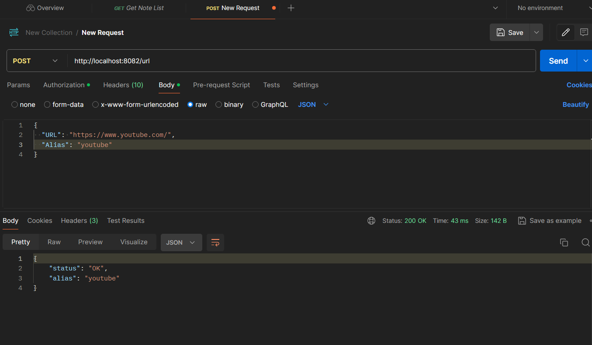
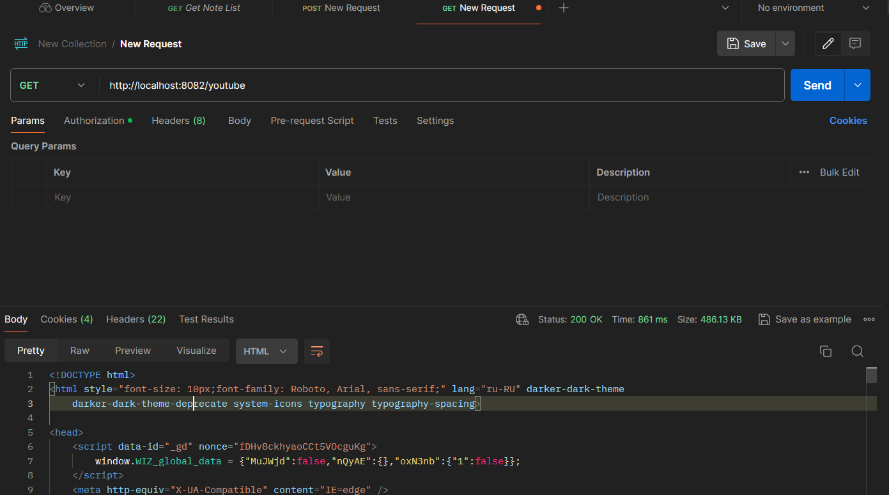

##RUN

RUN app

```bash
CONFIG_PATH=~/url-shortener/config/local.yaml  go run main.go
```
You can expose envirenment it differently 

Run test 

```bash
go test
```

## Добавление url от пользоватея


## Перенаправление на сохраненный url 

